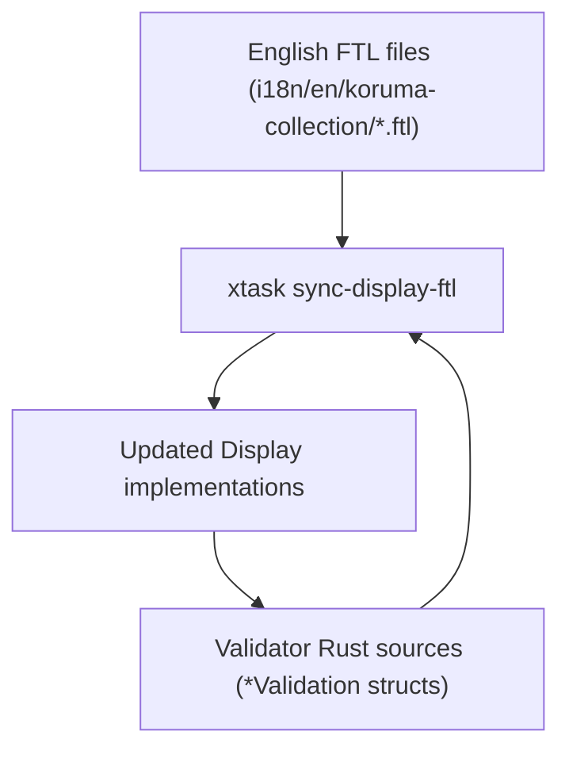

# Architecture: xtask

## Purpose

`xtask` provides workspace maintenance tasks for this project.

## CLI commands

- `sync-display-ftl`: synchronizes English FTL messages with `std::fmt::Display` implementations in `koruma-collection` validators.
- `build-book`: builds mdBook documentation to `web/public/book`.
- `build-llms-txt`: concatenates mdBook sources into `web/public/llms.txt` for LLM consumption.

### sync-display-ftl

#### Responsibilities

`sync-display-ftl` keeps `Display` implementations in sync with FTL localization:

1. Scans `crates/koruma-collection/src/validators` for `*Validation` structs with `#[fluent(...)]` attributes.
2. Parses English FTL messages from `crates/koruma-collection/i18n/en/koruma-collection/*.ftl`.
3. Updates `write!` macro calls in `Display` implementations to match FTL message templates.

#### Data Flow

#### Notes

- Validator discovery is based on struct names ending in `Validation` with a `#[fluent(namespace = "...")]` attribute.
- Message IDs are derived from struct names via snake_case conversion.
- Placeholder resolution maps FTL variables to `self.field` expressions based on struct field names.
- `--check` mode exits non-zero if any files would change (useful for CI).

### build-book

- `xtask/src/commands/build_book.rs`: invokes `mdbook build` with output to `web/public/book`, adds `.gitignore` to exclude built files from version control.

### build-llms-txt

- `xtask/src/commands/build_llms_txt.rs`: reads `SUMMARY.md`, extracts referenced markdown files, concatenates their content with separators.
