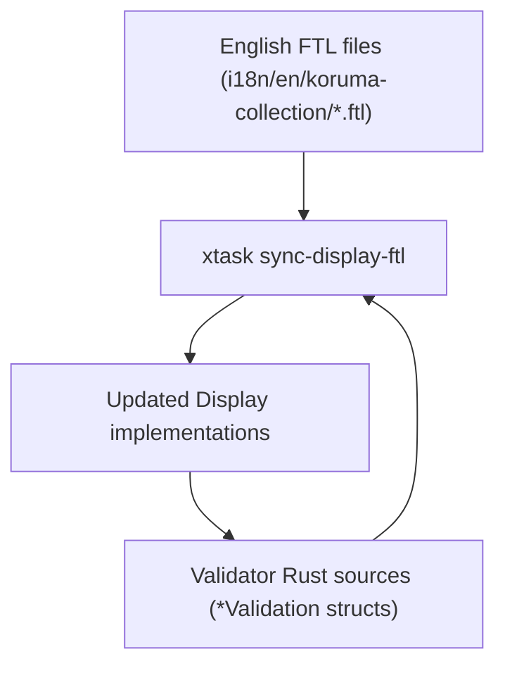

# Architecture: xtask

## Purpose

`xtask` provides workspace maintenance tasks for this project.

## CLI commands

- `sync-display-ftl`: synchronizes English FTL messages with `std::fmt::Display` implementations in `koruma-collection` validators.
- `build`: collection of subcommands:
  - `build book`: builds mdBook documentation to `web/public/book`.
  - `build llms-txt`: exports mdBook sources into `web/public/llms.txt`, `web/public/llms-full.txt`, and per-chapter Markdown files under `web/public/llms/` for LLM consumption.
  - `build web`: builds the Dioxus site into `web/dist` for GitHub Pages.
- `release plan`: computes the crates.io publish order for publishable workspace crates.
- `release publish`: prints or executes publish commands one package at a time in release order.

### sync-display-ftl

#### Responsibilities

`sync-display-ftl` keeps `Display` implementations in sync with FTL localization:

1. Scans `crates/koruma-collection/src/validators` for `*Validation` structs with `#[fluent(...)]` attributes.
2. Parses English FTL messages from `crates/koruma-collection/i18n/en/koruma-collection/*.ftl`.
3. Updates `write!` macro calls in `Display` implementations to match FTL message templates.

#### Data Flow

#### Notes

- Validator discovery is based on struct names ending in `Validation` with a `#[fluent(namespace = "...")]` attribute.
- Message IDs are derived from struct names via snake_case conversion.
- Placeholder resolution maps FTL variables to `self.field` expressions based on struct field names.
- `--check` mode exits non-zero if any files would change (useful for CI).

### Shared public-repo helpers

- `xtask/src/commands/build_book.rs`, `build_llms_txt.rs`, `build_web.rs`, and `release.rs` are thin wrappers around `stayhydated-xtask` in `../stayhydated/crates/stayhydated-xtask`.
- Keep reusable maintenance behavior in `shared` when it should apply to other public repositories. Keep koruma-specific command wiring, paths, constants, and `sync-display-ftl` in this workspace.

### build-book

- `xtask/src/commands/build_book.rs`: calls the shared mdBook builder with output to `web/public/book`.

### build-llms-txt

- `xtask/src/commands/build_llms_txt.rs`: calls the shared llms export builder with koruma's base URL and `xtask/templates/llms-header.md`.

### build-web

- `xtask/src/commands/build_web.rs`: calls the shared Dioxus SSG packaging helper with koruma's Dioxus arguments, copied static directories, and sitemap output.

### release

- `xtask/src/commands/release.rs`: maps CLI arguments into `stayhydated_xtask::release::PublishOptions`. The shared implementation reads Cargo metadata, topologically sorts publishable crates by non-dev workspace dependencies, prints or runs publish commands, uses `cargo hack --no-dev-deps publish` by default, guards cargo-hack manifest rewrites with a clean tracked worktree check, supports `--from <package>` for resuming, and can retry failures caused by crates.io index propagation.
